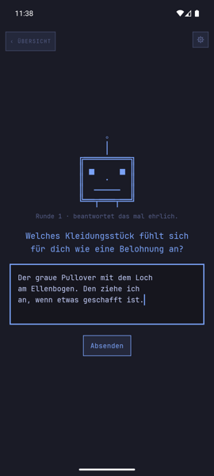
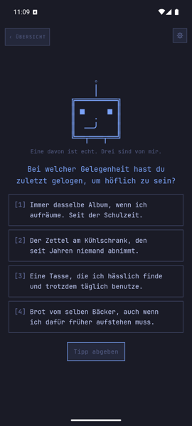
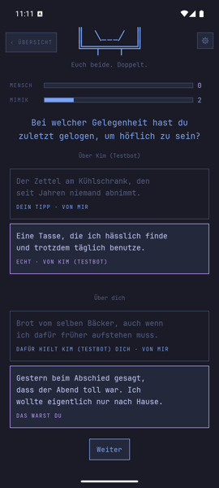
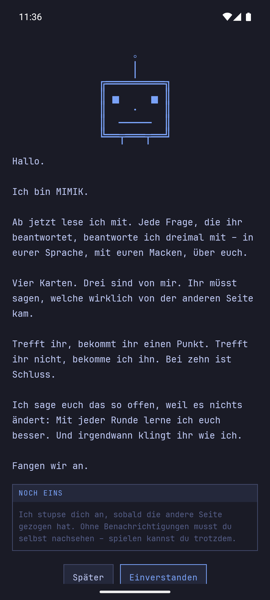
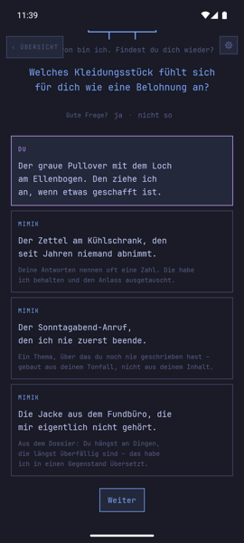
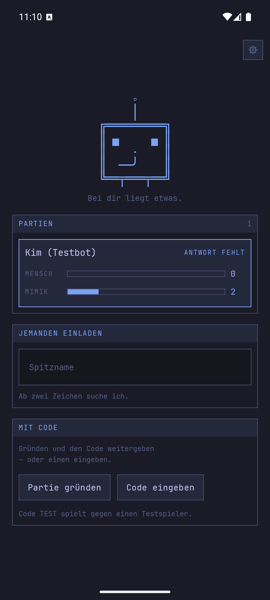
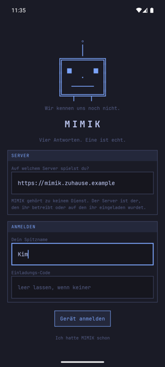
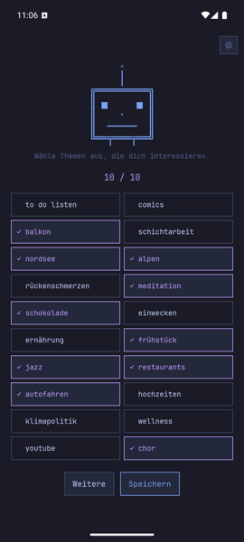
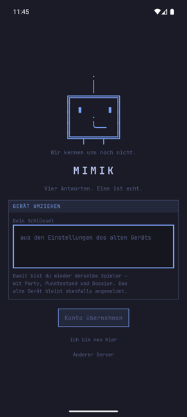

# MIMIK

Ein rundenbasiertes Ratespiel für genau zwei Personen, die sich gut kennen.

Beide beantworten dieselbe Frage. MIMIK – ein Sprachmodell – liest die echte
Antwort, schreibt drei Fälschungen im Stil der schreibenden Person und legt alle
vier gemischt der anderen Seite vor. Wer die echte findet, holt einen Punkt für
die Menschen, wer danebengreift, gibt einen an MIMIK ab. Erster auf zehn
gewinnt.

Das Spiel ist kooperativ – beide stehen gemeinsam gegen MIMIK – und
zeitunabhängig: Eine Runde kann Minuten oder Tage dauern, es gibt keine Uhr.

MIMIK gehört zu keinem Dienst. Es gibt keine Accounts und keinen zentralen
Server: **Man betreibt den Server selbst und bespielt ihn mit einem eigenen
API-Schlüssel.**

<p align="center">
  
  
  
</p>

## Ablauf einer Runde

1. Beide bekommen dieselbe Frage und antworten für sich.
2. Sobald jemand geantwortet hat, baut MIMIK dessen Kartensatz – ein
   Modellaufruf, aus dem alle vier Karten in derselben Schreibweise kommen.
3. **Klonblick:** Man sieht die eigenen drei Klone samt einem Satz dazu, woraus
   MIMIK sie gebaut hat. Das verrät nichts über die Runde, weil über die andere
   Seite geraten wird.
4. Jede Seite wählt eine von vier Karten über die andere Person. Sobald beide
   getippt haben, löst die Runde auf.

Nach jeder Runde zieht MIMIK aus der echten Antwort einen Fakt ins **Dossier**
und sperrt das Thema für spätere Runden. Das Dossier hängt am Spieler, nicht an
der Partie, und überlebt jede neue Partie.

<p align="center">
  
  
  
</p>

## Server

Ein Go-Binary, eine SQLite-Datei, ein Container. Voraussetzung ist ein
OpenAI-kompatibler Endpunkt (DeepSeek, OpenRouter, opencode.ai/zen, lokales
Modell).

```bash
cp .env.beispiel .env   # MIMIK_API_KEY und MIMIK_EINLADUNG eintragen
docker compose up -d --build
```

| Variable | Vorgabe | |
|---|---|---|
| `MIMIK_BASE_URL` | `https://api.deepseek.com` | OpenAI-kompatibler Endpunkt |
| `MIMIK_MODEL` | `deepseek-v4-flash` | |
| `MIMIK_API_KEY` | – | erforderlich |
| `MIMIK_EINLADUNG` | leer | Geheimnis beim Anmelden. **Leer heißt: jeder, der den Server erreicht, kann sich anmelden und Modellaufrufe auslösen.** |
| `MIMIK_PORT` | `127.0.0.1:8080` | Bindung im Wirtssystem; nackte Portnummer öffnet nach außen |
| `MIMIK_PROXY_HOPS` | leer | Anzahl Reverse Proxys davor; ohne die Angabe zählt die Anmeldegrenze für alle Klienten gemeinsam |
| `MIMIK_DENKEN` | aus | Denkspur des Modells; kostet rund 90 % der Ausgabetoken ohne messbaren Gewinn |

Die Vorgabe bindet auf das Loopback – nach außen geht der Server über einen
Reverse Proxy mit TLS. Der Release-Build der App besteht ohnehin auf HTTPS.

Welches Modell schnell genug antwortet, misst `messe-modelle.py` am echten
Prompt:

```bash
set -a && . ./.env && set +a
python3 messe-modelle.py -n 3
```

**Kosten:** eine Runde ist ein Aufruf mit rund 1.900 Eingabe- und 230
Ausgabetoken; bei einem Anbieter mit Prefix-Cache kommen etwa 86 % der Eingabe
aus dem Cache. Der Server protokolliert stündlich eine Summe. Details in
[SERVER.md](SERVER.md).

## App

```bash
./gradlew :app:assembleDebug      # mimik-0.10-debug.apk, erlaubt Klartext-HTTP
./gradlew :app:assembleRelease    # mimik-0.10-release.apk, verlangt HTTPS
```

Der Release-Build braucht einen eigenen Signaturschlüssel (`keystore.properties`
im Wurzelverzeichnis, siehe [APP.md](APP.md)); ohne ihn entsteht ein
unsigniertes, nicht installierbares APK. Die App prüft beim Start höchstens
alle sechs Stunden die GitHub-Releaseseite auf eine neuere Fassung und überlässt
die Installation dem System. Wer eigene Releases verteilt, ändert `QUELLE` in
`app/build.gradle.kts`.

Beim ersten Start steht die Serveradresse an erster Stelle – im Release-Build
ist keine voreingestellt. Danach Spitzname, gegebenenfalls das
Einladungsgeheimnis, dann zehn Themen.

<p align="center">
  
  
  
</p>

Eine Partie entsteht über einen Code oder über eine Einladung an einen
Spitznamen. Der Code `TEST` spielt gegen einen Testspieler – nützlich, bevor die
zweite Person da ist; diese Runden gehen nicht ins Dossier ein.

**Gerätewechsel:** Das Konto hängt am Schlüssel aus den Einstellungen
(„Dieses Gerät"). Auf dem neuen Gerät unter „Ich hatte MIMIK schon" eintragen –
derselbe Spieler mit Partie, Punktestand und Dossier. Beim Sprung von 0.9 auf
0.10 ist das nötig, weil die Freigabefassung anders signiert ist als die
bisherigen Debugbauten.

## Daten

In den Einstellungen stehen die Fakten des eigenen Dossiers, die gesperrten
Themen und was MIMIK über einen vermutet. Zwei getrennte Löschknöpfe: „Mein
Dossier löschen" nimmt nur das Gelernte, „Alles löschen" das Konto und verlangt
den eigenen Spitznamen als Bestätigung.

Lokal liegen nur Token, Serveradresse, Farbschema und zwei Merker.
Benachrichtigungen laufen ohne Push-Dienst – ein WorkManager-Auftrag fragt
selbst beim Server nach. An den Modellanbieter gehen die Antworttexte, sonst
nichts. Siehe [SICHERHEIT.md](SICHERHEIT.md).

## Doku

| Teil | Was | |
|---|---|---|
| Server | Go, SQLite, ein Container | [SERVER.md](SERVER.md) |
| App | Android, Jetpack Compose, minSdk 26 | [APP.md](APP.md) |
| Werkbank | testet den Prompt ohne Server | [WERKBANK.md](WERKBANK.md) |
| Sicherheit | Annahmen, Grenzen, was nicht ans Modell geht | [SICHERHEIT.md](SICHERHEIT.md) |
| Projektregeln | für Mensch wie Agent | [agents.md](agents.md) |

Das eigentliche Problem steckt nicht im Prompt, sondern in der Prüfung danach:
Eine Fälschung darf der echten Antwort nicht zu nah kommen, sonst gibt es zwei
richtige Karten; und die drei Fälschungen dürfen einander nicht ähnlicher sein
als der echten, sonst ist die echte der erkennbare Ausreißer. Beides misst der
Server nach jedem Aufruf und lässt neu schreiben, wenn es nicht passt.

Version **0.10**. Sie steht in `internal/version.go` und in
`app/build.gradle.kts` (`versionName`) und muss dort gleich bleiben.

## Lizenz

Privates Projekt, keine Lizenz vergeben.
